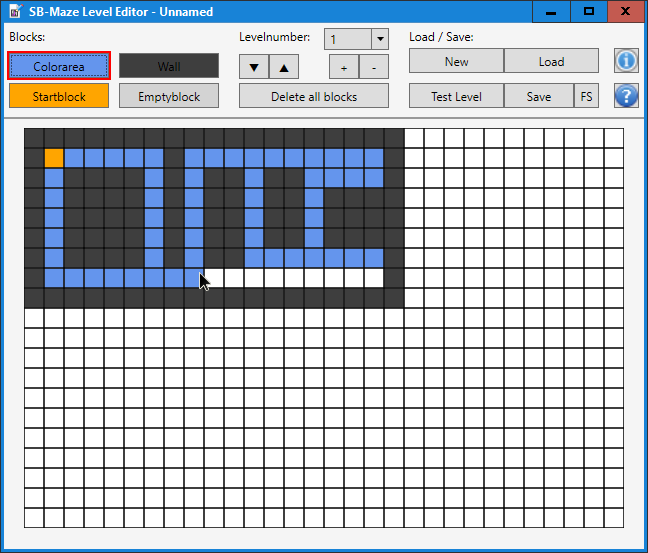

#  SB-Maze Level Editor
The level editor for my game SB-Maze (https://github.com/Computer-Freak-2004/SB-Maze)

Before you start please read the help! The level must meet certain requirements in order to function in the game.

## Features
-	Mouse support for level drawing (left: draw, right: delete)
-	Loading - and saving of multiple levels in one level file
-	Testfunction of levels

## Screenshot
 
